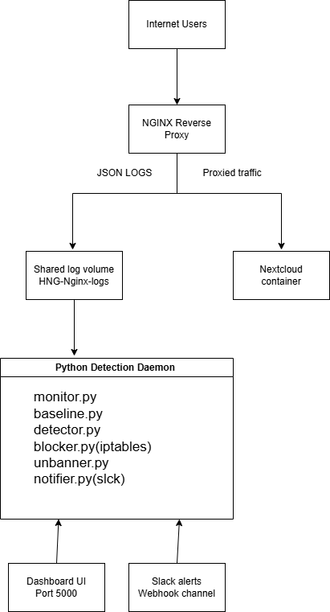

# HNG Stage 3 — Anomaly Detection Engine / DDoS Detection Tool



## Project Overview

A real-time anomaly detection engine built to monitor HTTP traffic flowing into a Nextcloud deployment. The system continuously learns normal traffic patterns, detects suspicious spikes, automatically blocks abusive IP addresses using `iptables`, sends Slack alerts, and exposes a live metrics dashboard for visibility.

**Built in Python because:**
- Excellent support for log processing
- `threading` makes daemon services easy to manage
- `deque` enables efficient sliding-window calculations
- Rapid prototyping allowed faster iteration

---

## Live Deployment

| Service | URL |
|---|---|
| Nextcloud Server | `http://34.228.247.241` |
| Metrics Dashboard | `http://34.228.247.241:5000` |

> The dashboard refreshes every 3 seconds and shows live request rate, baseline values, top source IPs, banned IPs, CPU/memory usage, and uptime.

---

## Repository Structure

```
detector/
├── main.py
├── monitor.py
├── baseline.py
├── detector.py
├── blocker.py
├── unbanner.py
├── notifier.py
├── dashboard.py
├── audit_logger.py
├── config.yaml
└── requirements.txt

nginx/
└── nginx.conf

docs/
└── architecture.png

screenshots/
└── required screenshots
```

---

## Core Features

### Real-Time Log Monitoring

The daemon continuously tails the Nginx JSON access log, capturing:

- Source IP
- Timestamp
- HTTP method
- Path
- Response status
- Response size

---

### Sliding Window Logic

Two `deque`-based sliding windows track requests over the last 60 seconds:

| Window | Scope |
|---|---|
| Per-IP | Requests from each individual IP |
| Global | All requests across the server |

Old entries expire automatically:

```python
while window and now - window[0] > 60:
    window.popleft()
```

---

### Rolling Baseline Engine

The baseline learns traffic patterns dynamically:

- Samples traffic every second
- Stores 30 minutes of history
- Recalculates every 60 seconds
- Maintains per-hour baseline slots
- Prefers current-hour baseline when enough data exists

**Metrics calculated:** `effective_mean`, `effective_stddev`, `error_mean`

---

### Anomaly Detection Rules

| Type | Trigger Condition |
|---|---|
| Per-IP anomaly | z-score > 3.0 **or** current rate > 5× baseline mean |
| Global anomaly | global z-score > 3.0 **or** global traffic > 5× baseline mean |
| Error surge | IP's 4xx/5xx rate exceeds 3× baseline error rate → thresholds tighten automatically |

---

### Automatic Blocking

Suspicious IPs are blocked via `iptables`:

```bash
iptables -A INPUT -s <IP> -j DROP
```

**Ban schedule (escalating):**

1. 10 minutes
2. 30 minutes
3. 2 hours
4. Permanent

---

### Automatic Unban

Temporary bans are lifted automatically after expiry:

```bash
iptables -D INPUT -s <IP> -j DROP
```

---

### Slack Notifications

Alerts are sent for:

- IP anomaly detected
- Global traffic anomaly
- IP unblocked

Each alert includes: trigger condition, request rate, baseline, timestamp, and duration.

---

### Live Dashboard

Real-time metrics display:

- Current req/s
- Top 10 source IPs
- Blocked IPs
- CPU & memory usage
- Baseline values
- Uptime

---

## Configuration

**`config.yaml`**

```yaml
log_file: /var/log/nginx/hng-access.log
z_threshold: 3.0
multiplier_threshold: 5
ban_schedule:
  - 600
  - 1800
  - 7200
slack_webhook: YOUR_WEBHOOK
```

---

## Setup Instructions

### 1. Clone the repo

```bash
git clone https://github.com/dev-hills/DDOS-detection-tool.git
cd DDOS-detection-tool
```

### 2. Start services

```bash
docker compose up --build -d
```

### 3. Verify containers

```bash
docker ps
```

### 4. View detector logs

```bash
docker logs -f detector
```

### 5. Verify dashboard

Open `http://34.228.247.241:5000` in your browser.

---

## Testing

**Simulate an attack with curl:**

```bash
for i in {1..500}; do curl http://34.228.247.241/ > /dev/null & done
```

**Or using k6:**

```bash
k6 run attack.js
```

---

## Audit Logging

Every event is recorded in `audit.log` with the following format:

```
[timestamp] ACTION ip | condition | rate | baseline | duration
```

**Example:**

```
[2026-04-29 16:12:49] BAN 104.x.x.x | z=49.0 | 50 | 1.0 | 600
```

---

## Screenshots

| Screenshot | Description |
|---|---|
| Tool Running | Detector daemon active |
| Ban Slack Alert | Slack notification on ban |
| Unban Slack Alert | Slack notification on unban |
| Global Alert | Global traffic anomaly alert |
| iptables Block | Firewall rule applied |
| Audit Log | Sample audit entries |
| Baseline Graph | Traffic baseline visualisation |

---

## Blog Post

Read the beginner-friendly write-up: **[How I Built a Real-Time Anomaly Detection Engine](https://medium.com/@hilaryemujede48/how-i-built-a-real-time-ddos-detection-tool-with-python-docker-and-iptables-29e15dbbee71)**

---

## Author

**Hilary Emujede**